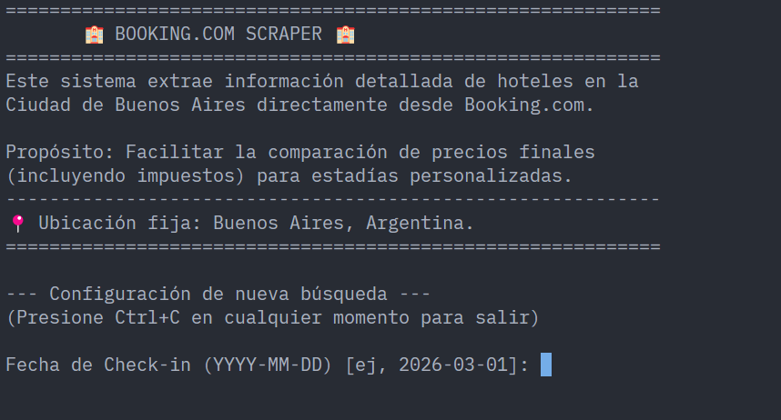

# Hoteles ubicados en Buenos Aires – Web Scraping Pipeline desde Booking.com

## Overview

Sistema de ingesta de datos de hoteles ubicados en Buenos Aires desde Booking.com. El sistema permite la extracción
en formato CSV de información de hoteles recomendados por Booking.com según su top de selecciones para su posterior análisis
o uso comercial.


**Stack:** Python 3.13+ · Playwright · Docker & docker-compose · uv · Pytest

---

## Contexto

Este proyecto surge de la necesidad personal de relevar y comparar costos reales de alojamiento en la Ciudad de Buenos Aires. La volatilidad de precios y la disparidad entre los valores base y los cargos adicionales (tasas e impuestos) dificultan la toma de decisiones informada. Por ello, se construyó esta herramienta de ingesta automatizada, diseñada para alimentar procesos de análisis de datos externos mediante la generación de archivos estructurados, permitiendo una comparativa granular que el navegador convencional no ofrece de forma agregada.

## Beneficios clave - A quién Ayuda

* **Analistas de Mercado**: Provee un flujo constante de datos estructurados para monitorear la oferta hotelera en la capital argentina.

* **Usuarios Finales**: Permite conocer el precio final (Base + Fees) de hasta 500 hoteles en una sola ejecución, evitando el cálculo manual por cada propiedad.

* **Data Engineers**: Funciona como un componente modular de ingesta que puede integrarse en pipelines de datos más complejos.

## Interfaz de usuario

El sistema opera mediante una interfaz de línea de comandos (CLI) interactiva que solicita al usuario parámetros de búsqueda como fechas de check-in/out, cantidad de huéspedes y límite de registros.



## Arquitectura del sistema 

La solución se basa en un diseño modular:

* **Scraper Core**: Gestiona la navegación mediante Playwright, implementando técnicas de stealth para reducir la tasa de bloqueo y manejo de eventos dinámicos como lazy loading y pop-ups.

* **Cleaning**: Métodos especializados en la normalización de strings financieros, convirtiendo formatos monetarios complejos (ej. $\xa0230,821) en valores flotantes precisos.

* **Writers**: Abstracción para la escritura de datos que asegura la persistencia en archivos CSV con versionado temporal.

* **Containerización**: Orquestación vía Docker para asegurar la reproducibilidad del entorno, incluyendo dependencias de sistema de Chromium.

## Ejecución del Proyecto

Para ejecutar el sistema mediante Docker, garantizando que todas las dependencias de navegador estén presentes, siga estos pasos:

1. **Construir la imagen**:
```bash
docker-compose build
```

2. **Iniciar la consola interactiva**:
```bash
docker-compose run --rm booking-scraper
```

El uso de `run --rm` es mandatorio para permitir la interacción con el prompt de configuración y asegurar la limpieza de contenedores tras la ejecución.

## Limitaciones y potenciales mejoras

* **Geográfica**: El sistema está estrictamente limitado a la búsqueda de hoteles en Buenos Aires, Argentina, debido a la configuración de parámetros geográficos en la URL de consulta.

* **Metodología**: Al ser un sistema basado en web scraping, es sensible a cambios estructurales en el DOM de Booking.com.

* **Escalabilidad**: Actualmente procesa hasta 500 hoteles por ejecución para mantener un perfil de tráfico orgánico; volúmenes mayores requerirían la implementación de proxies rotativos.

---

**Autor:** Gerardo Toboso · [gerardotoboso1909@gmail.com](mailto:gerardotoboso1909@gmail.com)

**Licencia:** MIT
