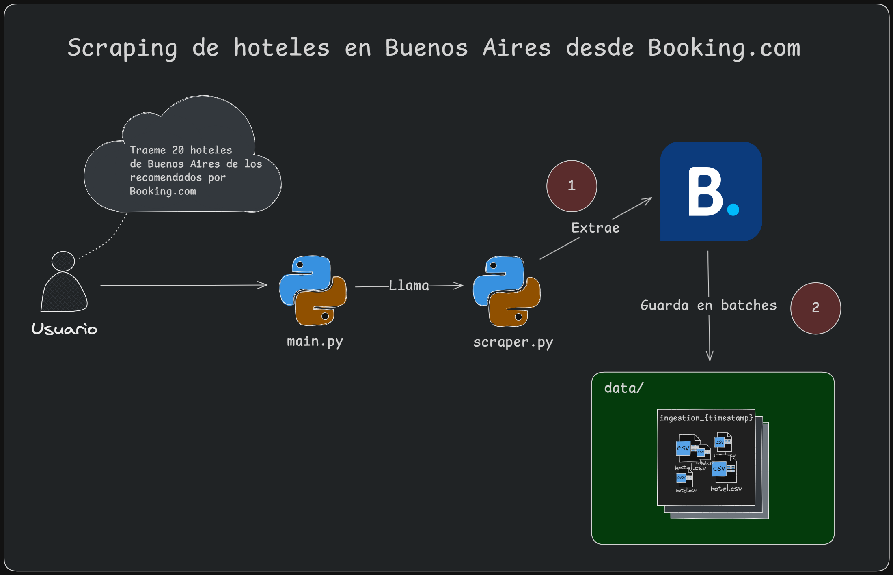

# Hoteles ubicados en Buenos Aires – Web Scraping Pipeline desde Booking.com

## Overview

Sistema de ingesta de datos de hoteles ubicados en Buenos Aires desde Booking.com. El sistema permite la extracción
en formato CSV de información de hoteles recomendados por Booking.com según su top de selecciones para su posterior análisis
o uso comercial.

**Stack:** Python 3.13+ · csv

---

**Autor:** Gerardo Toboso · [gerardotoboso1909@gmail.com](mailto:gerardotoboso1909@gmail.com)

**Licencia:** MIT
